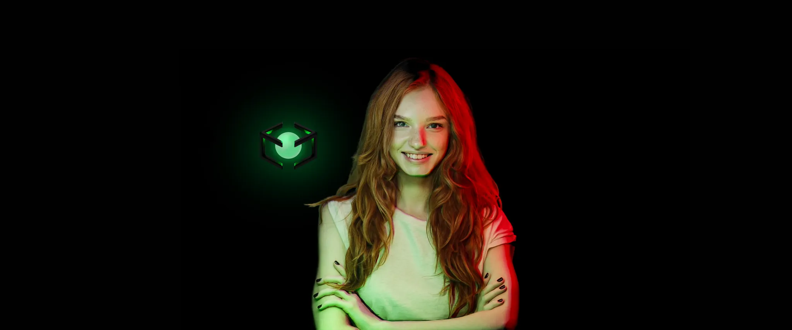

# We Rebranded! SwitchLight is now **Beeble**

Our relighting and PBR map extraction are now available on the web — no installs, no headaches.  

🚀 **Try Beeble Today → [beeble.ai](https://beeble.ai)**  

### What’s New:

**1️⃣ Web-Based VFX Pass Generation**  
Generate Albedo, Normal, Roughness, Specular, Motion Vector, Alpha, and Depth — all in the cloud.  
✅ Mac-friendly (no OS issues!)  
✅ Sharper normals  
✅ Faster + more accurate depth maps  

**2️⃣ Real-Time Relighting in Your Browser**  
Relight scenes instantly — no need for Blender or Unreal.  
Upload HDRIs or use built-in lighting tools for full creative control.  

**3️⃣ Brand New Blender & UE Add-on**  
Massively upgraded from the old SwitchLight version.  
Send assets directly to Blender with a smoother, more integrated workflow.
